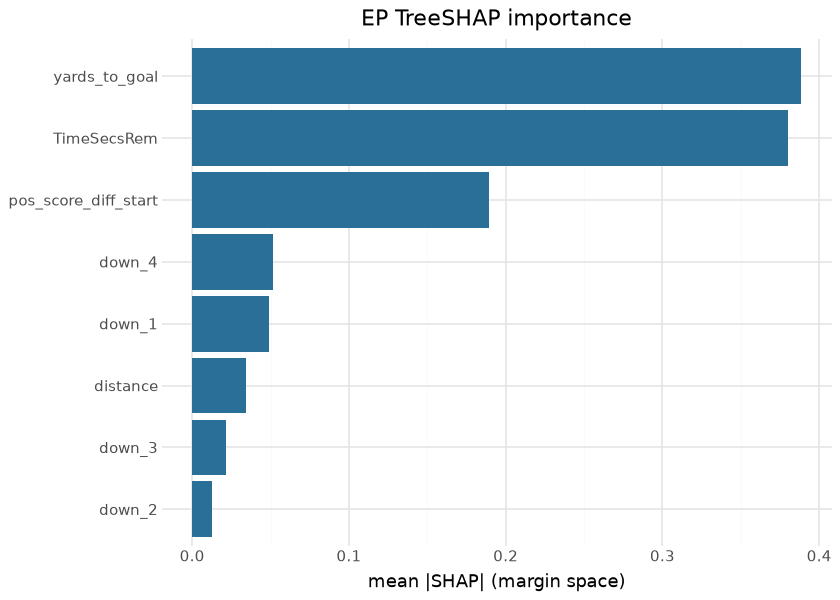
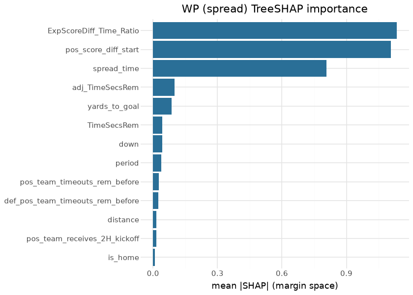
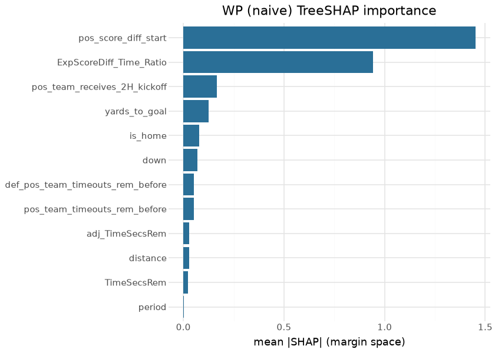
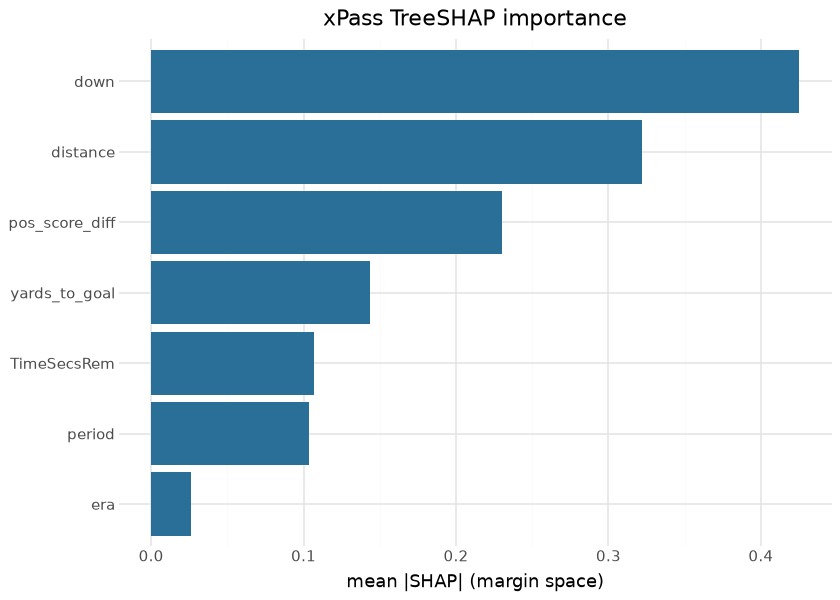
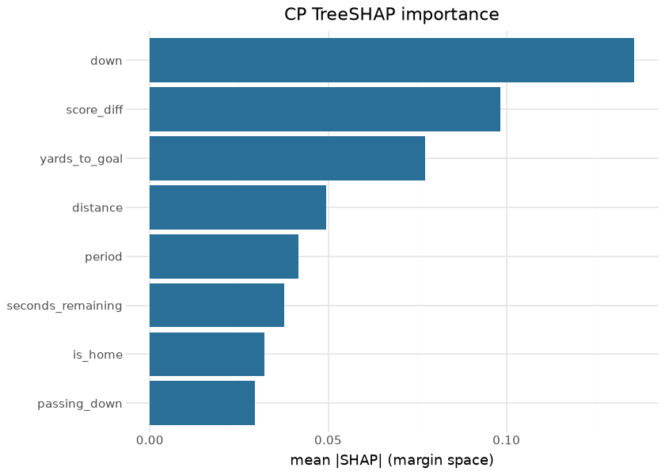
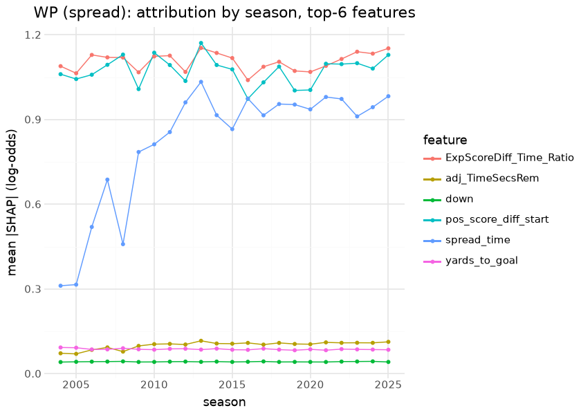

# CFB model suite — reproducible deep dive

The per-model cards in this directory are **generated** by
`cfb_model_reports` (stage `cfb_model_70_reports`) from the training
pipeline’s real artifacts — they are already compiled documents, rebuilt
on every reports run, with LOSO metrics and calibration figures produced
by the same code that trains the models. This page is their **Quarto
companion**: a suite-level deep dive the generator does not own,
recomputing the leave-one-season-out evaluations from the committed
out-of-fold artifacts, attributing the boosters with TreeSHAP, and
putting identified, human-readable results tables on the published
surfaces. Everything here is computed at render time — from
`python/artifacts/` (the model pipeline’s output tree; regenerate with
`scripts/cfb_models.sh`) and the published releases.

## The corpus

| Training corpus (python/artifacts/pbp_full.parquet) — last 10 of 22 seasons |  |  |  |
|----|----|----|----|
| the exact frame the trainers read; regenerated by the model pipeline |  |  |  |
| season | plays | games | mean_epa |
| 2016 | 94,384 | 577 | −0.1441 |
| 2017 | 94,492 | 586 | 0.0187 |
| 2018 | 92,448 | 571 | 0.0388 |
| 2019 | 88,349 | 553 | 0.0493 |
| 2020 | 66,340 | 415 | 0.0557 |
| 2021 | 116,810 | 748 | 0.0473 |
| 2022 | 126,137 | 810 | 0.0164 |
| 2023 | 131,644 | 869 | 0.0295 |
| 2024 | 134,707 | 889 | 0.0445 |
| 2025 | 132,521 | 871 | 0.0169 |

&#10;

## Exploratory data analysis

## LOSO evaluation, recomputed from the out-of-fold artifacts

The pipeline persists every model’s leave-one-season-out out-of-fold
predictions under `python/artifacts/loso_*_oof.parquet`. Recomputing the
headline metrics from those files — rather than quoting the cards —
keeps this page honest against the artifacts themselves:

| LOSO out-of-fold metrics — recomputed at render time |  |  |  |
|----|----|----|----|
| from python/artifacts/loso\_\*\_oof.parquet; every prediction is from a model that never saw its season |  |  |  |
| model | n_oof | metric | value |
| EP | 2,219,607 | MAE | 4.1030 |
| WP (spread) | 2,219,660 | Brier | 0.1135 |
| WP (naive) | 2,219,607 | Brier | 0.1332 |
| FG | 42,615 | Brier | 0.1749 |
| QBR | 22,833 | MAE | 13.3996 |
| Two-point | 1,622 | Brier | 0.2493 |

&#10;

## SHAP — the promoted boosters attributed

The five score-time boosters below are the **promoted** artifacts — the
`python/artifacts/v2/` fits, byte-identical to the `.ubj` files sdv-py
bundles in `cfb/models/` (the CP booster is read from that bundle).
Their feature matrices come from the trainer’s own analysis export:
`python -m cfb_model_build.model_training export-analysis` writes
`python/artifacts/analysis/analysis_{ep,wp,xpass,cp}.parquet` through
the very `ep_matrix` / `wp_matrix` / `xpass_frame` /
`extract_pass_features` code paths the fits use, so `spread_time`,
`adj_TimeSecsRem`, `ExpScoreDiff_Time_Ratio`, `score_diff` and `era` are
the engineered columns the boosters actually saw, not a re-derivation on
this page. TreeSHAP is XGBoost’s own `pred_contribs=True` (no `shap`
dependency); the multiclass EP tensor is 3-D and is averaged over its
seven class margins, the binary models are 2-D.

| Which booster each attribution below explains |  |  |  |  |  |  |  |  |
|----|----|----|----|----|----|----|----|----|
| analysis frames from pbp_full_v2.parquet (sha256 48d7e7c8561b, export-analysis 2026-09-02); booster sha256 compared against the .ubj bundled in sdv-py 0.1.3; 'trained on' from each booster's card |  |  |  |  |  |  |  |  |
| Model | Artifact | sha256\[:12\] | vs bundle | Trained on | Frame | Features | Frame rows | SHAP sample |
| EP (7-class) | python/artifacts/v2/ep_model.ubj | 44516f561836 | = sdv-py bundle | pbp_full_v2.parquet | same frame | 8 | 2,219,971 | 4,000 |
| WP (spread) | python/artifacts/v2/wp_spread.ubj | 486699334ef9 | = sdv-py bundle | pbp_full_v2.parquet | same frame | 13 | 2,219,971 | 4,000 |
| WP (naive) | python/artifacts/v2/wp_naive.ubj | 624ee1494330 | = sdv-py bundle | pbp_full_v2.parquet | same frame | 12 | 2,219,971 | 4,000 |
| xPass | python/artifacts/v2/xpass_model.ubj | 90a27a21e49d | = sdv-py bundle | pbp_full_v2.parquet | same frame | 7 | 1,902,481 | 4,000 |
| CP | sdv-py bundle/cfb_cp_model.ubj | 71d52772ee59 | = sdv-py bundle | n/a (no card) | n/a | 8 | 921,377 | 4,000 |

&#10;

| Top-3 features per booster — mean \|SHAP\| and share of total attribution |  |  |  |  |
|----|----|----|----|----|
| margin space (log-odds; EP: class-margin mean); shares sum to 1 over each model's full feature set |  |  |  |  |
| Model | \# | Feature | mean \|SHAP\| | Share |
| EP (7-class) | 1 | yards_to_goal | 0.388 | 34.4% |
| EP (7-class) | 2 | TimeSecsRem | 0.380 | 33.7% |
| EP (7-class) | 3 | pos_score_diff_start | 0.190 | 16.8% |
| WP (spread) | 1 | ExpScoreDiff_Time_Ratio | 1.134 | 32.8% |
| WP (spread) | 2 | pos_score_diff_start | 1.108 | 32.1% |
| WP (spread) | 3 | spread_time | 0.808 | 23.4% |
| WP (naive) | 1 | pos_score_diff_start | 1.451 | 48.0% |
| WP (naive) | 2 | ExpScoreDiff_Time_Ratio | 0.943 | 31.2% |
| WP (naive) | 3 | pos_team_receives_2H_kickoff | 0.167 | 5.5% |
| xPass | 1 | down | 0.425 | 31.3% |
| xPass | 2 | distance | 0.322 | 23.7% |
| xPass | 3 | pos_score_diff | 0.230 | 16.9% |
| CP | 1 | down | 0.136 | 27.1% |
| CP | 2 | score_diff | 0.098 | 19.6% |
| CP | 3 | yards_to_goal | 0.077 | 15.4% |

&#10;

What the attributions say — 4,000-play samples (seed 11); the exact
values are in the top-3 table above:

- **EP.** Field position and clock split the top: `yards_to_goal` 34.4%
  and `TimeSecsRem` 33.7% of total attribution, score state
  (`pos_score_diff_start`) third at 16.8%, the four down dummies
  together about 14%. That is the cfbscrapR ordering attributed
  play-by-play — on the promoted booster the first two are effectively
  tied rather than field position clearly first.
- **WP (spread).** Two score-state terms carry it —
  `ExpScoreDiff_Time_Ratio` 32.8% and `pos_score_diff_start` 32.1% —
  with `spread_time` the third pillar at 23.4%; no clock or field term
  exceeds 3%. **WP (naive)** drops `spread_time` and that share does not
  disappear: `pos_score_diff_start` absorbs it (32.1% → 48.0%),
  `ExpScoreDiff_Time_Ratio` holds at 31.2%, and
  `pos_team_receives_2H_kickoff` becomes the third feature (5.5%).
- **xPass** reads the situation first — `down` 31.3%, `distance` 23.7% —
  then score (`pos_score_diff` 16.9%), field position (10.6%) and clock
  (7.9%); `era` and `period` are the tail, so rule-era pass tendency is
  a small effect once down-and-distance is in.
- **CP** is the game-state-only Approach A and attributes like one:
  `down` 27.1%, `score_diff` 19.6%, `yards_to_goal` 15.4%, `distance`
  9.9%, `period` 8.3%. What an air-yards feature would add is the
  recorded CPOE feasibility finding; SHAP cannot supply it here.
- **By season (WP spread, 1,500 plays × 22 seasons).** The score-state
  terms move within a narrow band — `ExpScoreDiff_Time_Ratio` 1.04–1.15,
  `pos_score_diff_start` 0.97–1.17 (extremes at 2016 and 2013),
  `adj_TimeSecsRem` 0.07–0.12 — with no step at the 2006/2013/2020
  rule-era cuts. `spread_time` is the exception: 0.31 in 2004, about 1.0
  from 2013 on (0.98 in 2025). That ramp is neither a rule effect nor
  missing data (`spread_time` is non-null in every season): it is the
  ESPN **default spread**. In the training frame every 2004 and 2005
  game carries `homeTeamSpread = ±2.5` with `gameSpreadAvailable = 0`,
  as do 57% of 2006 games, 67% of 2008, 8.7% of 2013 and 5.1% of 2025 —
  the `cfb_line_odds` consensus backfill closed 2,167 games but not the
  earliest seasons. A 2.5-point placeholder decays to a near-constant,
  so the booster has nothing to attribute to it, and the early-season
  WP-spread model runs close to the naive one. The fix is upstream of
  SHAP — a historical-spread source for 2004–2008 — and belongs with the
  backfill work, not this page.

## Results — the scored surfaces, identified

| Top 10 offenses by EPA/play — 2025 model_pbp |  |  |  |
|----|----|----|----|
| source: python/artifacts/model_pbp_2025.parquet (stage 10 build tree, scored 2026-09-01 with cfb_cp_model.ubj) |  |  |  |
|  | Offense | Plays | EPA/play |
|  | Alabama State | 64 | 0.521 |
|  | Vanderbilt | 796 | 0.341 |
|  | Gardner-Webb | 61 | 0.301 |
|  | North Dakota State | 795 | 0.300 |
|  | North Texas | 984 | 0.293 |
|  | Montana | 59 | 0.290 |
|  | Navy | 813 | 0.289 |
|  | Utah | 945 | 0.278 |
|  | Notre Dame | 748 | 0.275 |
|  | Indiana | 1,059 | 0.262 |

&#10;

| Passer EPA/play leaders with CPOE — 2025 (min 150 dropbacks) |  |  |  |  |  |
|----|----|----|----|----|----|
| source: python/artifacts/model_pbp_2025.parquet (stage 10 build tree, scored 2026-09-01 with cfb_cp_model.ubj); keyed by ESPN athlete id (passer_player_id), headshots from a.espncdn.com |  |  |  |  |  |
|  | Passer | Team | Dropbacks | EPA/play | CPOE |
|  | Cole Payton | North Dakota State | 244 | 0.452 | 0.077 |
|  | Julian Sayin | Ohio State | 405 | 0.437 | 0.150 |
|  | Diego Pavia | Vanderbilt | 397 | 0.421 | 0.091 |
|  | Blake Horvath | Navy | 165 | 0.419 | 0.023 |
|  | Jayden Maiava | USC | 411 | 0.387 | 0.073 |
|  | Joe Fagnano | UConn | 421 | 0.364 | 0.101 |
|  | Drew Mestemaker | North Texas | 480 | 0.348 | 0.068 |
|  | Fernando Mendoza | Indiana | 404 | 0.336 | 0.086 |
|  | Brendan Sorsby | Cincinnati | 346 | 0.335 | 0.028 |
|  | CJ Carr | Notre Dame | 305 | 0.335 | 0.056 |

&#10;

| cfb_ratings top 25 — 2025 (opponent-adjusted EPA components) |  |  |  |  |  |
|----|----|----|----|----|----|
| published cfb_ratings release; net = off − def + st |  |  |  |  |  |
| logo | team_id | adj_off_epa | adj_def_epa | adj_st_epa | adj_net |
|  | 84 | 0.336 | −0.200 | 0.356 | 0.536 |
|  | 87 | 0.298 | −0.225 | −0.386 | 0.523 |
|  | 194 | 0.250 | −0.270 | −0.568 | 0.520 |
|  | 2390 | 0.214 | −0.281 | −0.088 | 0.494 |
|  | 2483 | 0.204 | −0.227 | 0.635 | 0.431 |
|  | 2641 | 0.054 | −0.370 | 0.687 | 0.425 |
|  | 245 | 0.224 | −0.200 | −0.396 | 0.425 |
|  | 145 | 0.237 | −0.127 | 0.862 | 0.364 |
|  | 333 | 0.145 | −0.187 | −0.057 | 0.332 |
|  | 264 | 0.202 | −0.129 | 0.033 | 0.332 |
|  | 201 | −0.011 | −0.342 | 0.813 | 0.331 |
|  | 61 | 0.162 | −0.168 | 0.933 | 0.329 |
|  | 251 | 0.112 | −0.214 | 0.321 | 0.326 |
|  | 254 | 0.223 | −0.081 | 0.116 | 0.305 |
|  | 30 | 0.242 | −0.060 | −0.676 | 0.302 |
|  | 142 | 0.081 | −0.212 | −0.106 | 0.293 |
|  | 52 | 0.208 | −0.071 | −0.300 | 0.280 |
|  | 238 | 0.329 | 0.054 | 0.783 | 0.275 |
|  | 2294 | 0.044 | −0.225 | 0.443 | 0.269 |
|  | 213 | 0.138 | −0.119 | 0.551 | 0.257 |
|  | 221 | 0.059 | −0.192 | −0.076 | 0.251 |
|  | 97 | 0.102 | −0.147 | 0.083 | 0.249 |
|  | 9 | 0.082 | −0.160 | −0.435 | 0.242 |
|  | 252 | 0.130 | −0.108 | −0.135 | 0.239 |
|  | 2 | 0.070 | −0.166 | 0.301 | 0.237 |

&#10;

| cfb_recruiting_proj top 10 — 2025 published asset |  |  |  |  |
|----|----|----|----|----|
| the recruiting-talent projection surface (full writeup: cfb_recruiting_proj.md) |  |  |  |  |
| logo | season | pred_wins | pred_margin | pred_net_epa |
|  | 2,025.000 | 9.883 | 18.772 | <na> |
|  | 2,025.000 | 8.889 | 14.324 | <na> |
|  | 2,025.000 | 10.033 | 18.911 | <na> |
|  | 2,025.000 | 9.689 | 17.380 | <na> |
|  | 2,025.000 | 10.338 | 20.234 | <na> |
|  | 2,025.000 | 10.620 | 21.412 | <na> |
|  | 2,025.000 | 8.823 | 13.921 | <na> |
|  | 2,025.000 | 10.359 | 20.006 | <na> |
|  | 2,025.000 | 7.868 | 9.567 | <na> |
|  | 2,025.000 | 8.857 | 13.702 | <na> |

&#10;

## Provenance & reproducibility

- **Per-model cards** (`ep.md` … `pregame_wp.md`): generated by
  `python -m cfb_model_reports` (stage `cfb_model_70_reports` /
  `scripts/cfb_models.sh 70`) from the training pipeline’s artifacts —
  the cards are compiled documents already; regenerating them is part of
  the model pipeline.
- **This page** (`deepdive.qmd` → `deepdive.md`): rendered by
  `scripts/render_model_docs.sh` (Quarto → GFM, `--output-dir .` because
  this directory is also a Quarto website project). Inputs:
  `python/artifacts/` (LOSO OOF parquets, `pbp_full.parquet`, boosters —
  regenerate via `scripts/cfb_models.sh`), the per-model **analysis
  frames** `python/artifacts/analysis/`
  (`CFB_MODELS_ARGS="export-analysis --pbp   python/artifacts/pbp_full.parquet --out-dir python/artifacts/analysis"   scripts/cfb_models.sh 30`,
  or the same subcommand via `python -m cfb_model_build.model_training`;
  the CI pipeline runs it right after `ingest`), the stage-10 scored
  frame `python/artifacts/model_pbp_2025.parquet` when present
  (`scripts/cfb_models.sh 10` for the season), and the published
  `espn_cfb_model_pbp` / `cfb_ratings` releases (cached under
  `docs/models/.cache/`, gitignored).
- **Training data:** seasons 2004–2025 (the corpus table above is
  computed from the exact training frame). Models, gates and lineage:
  `models/manifest.yaml`, `models/REGISTRY.md`.
- **Forward-looking notes** live in [roadmap.md](roadmap.md) — the
  hand-authored companion the generator cannot clobber.

## Avenues for improvement & open issues

- **Resolved (2026-09-01, PR \#56):** *Per-model SHAP for the full
  suite* — the trainer now exports the engineered feature matrix per
  model (`export-analysis` →
  `python/artifacts/analysis/analysis_{ep,wp,xpass,cp}.parquet`, built
  through the same `*_matrix` code paths the fits use) and this page
  attributes EP, WP-spread, WP-naive, xPass and CP against the promoted
  boosters, with a by-season slice for WP.
- **Resolved (2026-09-01, PR \#56):** *Athlete ids in model_pbp* — the
  ids were never absent upstream (sdv-py’s participants module emits
  them and every final.json carried them); the model_pbp builder’s
  `DESCRIPTOR_COLS` was the drop point. The frame now carries
  `passer_player_id`, `rusher_player_name`/`_id`,
  `receiver_player_name`/`_id` (Int64, additive), and the passer table
  keys on the id and ships headshots. The published release gains the
  columns on its next stage-10 + publish run.
- **Known issue:** `python/artifacts/` is a build tree, not committed —
  a fresh clone must run the model pipeline before this page renders.
  That is deliberate (artifacts are large), but it makes this page’s
  reproducibility contingent on the pipeline run; the cards’ generator
  has the same property.
