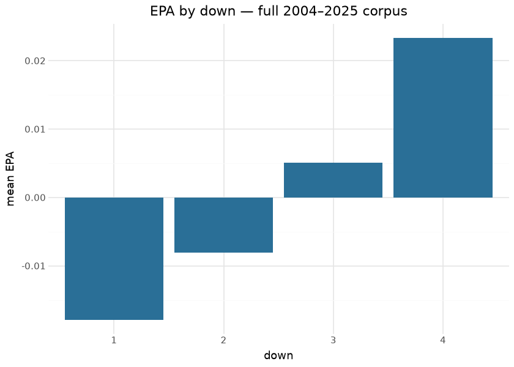
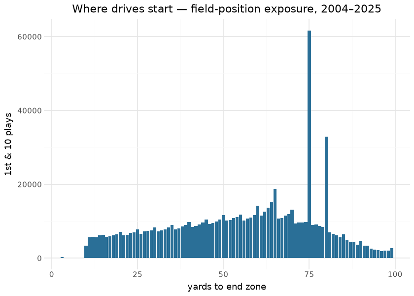
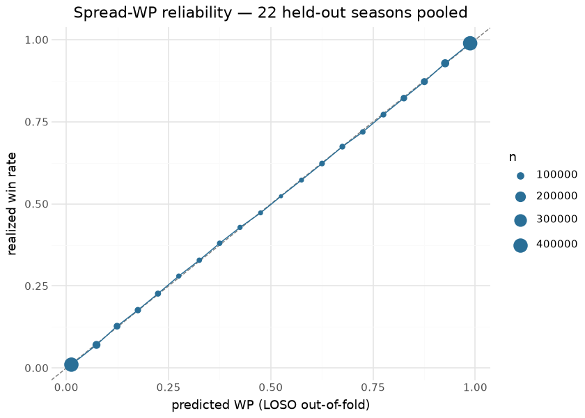
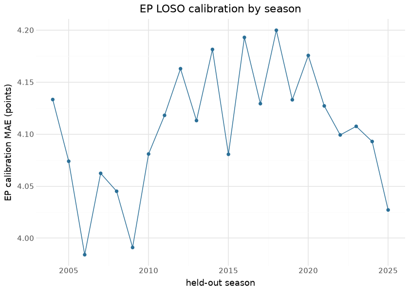
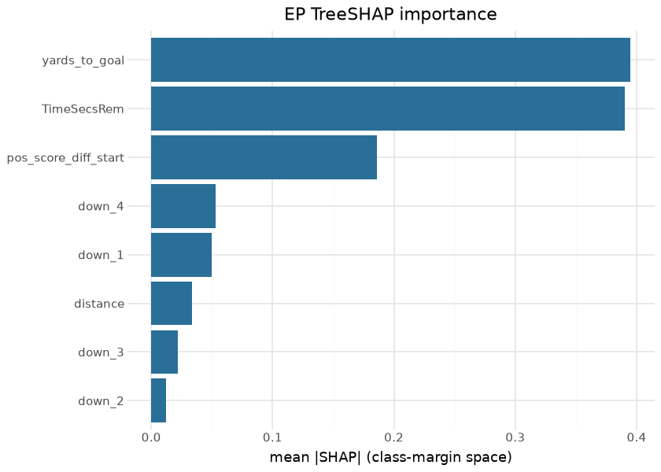

# CFB model suite — reproducible deep dive

The per-model cards in this directory are **generated** by
`cfb_model_reports` (stage `cfb_model_70_reports`) from the training
pipeline’s real artifacts — they are already compiled documents, rebuilt
on every reports run, with LOSO metrics and calibration figures produced
by the same code that trains the models. This page is their **Quarto
companion**: a suite-level deep dive the generator does not own,
recomputing the leave-one-season-out evaluations from the committed
out-of-fold artifacts, attributing the boosters with TreeSHAP, and
putting identified, human-readable results tables on the published
surfaces. Everything here is computed at render time — from
`python/artifacts/` (the model pipeline’s output tree; regenerate with
`scripts/cfb_models.sh`) and the published releases.

## The corpus

| Training corpus (python/artifacts/pbp_full.parquet) — last 10 of 22 seasons |  |  |  |
|----|----|----|----|
| the exact frame the trainers read; regenerated by the model pipeline |  |  |  |
| season | plays | games | mean_epa |
| 2016 | 94,384 | 577 | −0.1441 |
| 2017 | 94,492 | 586 | 0.0187 |
| 2018 | 92,448 | 571 | 0.0388 |
| 2019 | 88,349 | 553 | 0.0493 |
| 2020 | 66,340 | 415 | 0.0557 |
| 2021 | 116,810 | 748 | 0.0473 |
| 2022 | 126,137 | 810 | 0.0164 |
| 2023 | 131,644 | 869 | 0.0295 |
| 2024 | 134,707 | 889 | 0.0445 |
| 2025 | 132,521 | 871 | 0.0169 |

&#10;

## Exploratory data analysis

## LOSO evaluation, recomputed from the out-of-fold artifacts

The pipeline persists every model’s leave-one-season-out out-of-fold
predictions under `python/artifacts/loso_*_oof.parquet`. Recomputing the
headline metrics from those files — rather than quoting the cards —
keeps this page honest against the artifacts themselves:

| LOSO out-of-fold metrics — recomputed at render time |  |  |  |
|----|----|----|----|
| from python/artifacts/loso\_\*\_oof.parquet; every prediction is from a model that never saw its season |  |  |  |
| model | n_oof | metric | value |
| EP | 2,219,607 | MAE | 4.1030 |
| WP (spread) | 2,219,660 | Brier | 0.1135 |
| WP (naive) | 2,219,607 | Brier | 0.1332 |
| FG | 42,615 | Brier | 0.1749 |
| QBR | 22,833 | MAE | 13.3996 |
| Two-point | 1,622 | Brier | 0.2493 |

&#10;

## SHAP — the EP booster attributed

Field position dominates, clock second, score state third — the
cfbscrapR ordering, now attributed play-by-play rather than asserted.
The multiclass `pred_contribs` tensor is 3-D (the recorded gotcha); the
chart aggregates \|contribution\| across the seven class margins and is
labeled accordingly.

## Results — the published surfaces, identified

| Top 10 offenses by EPA/play — 2025 published model_pbp |  |  |  |
|----|----|----|----|
|  | Offense | Plays | EPA/play |
|  | Alabama State | 64 | 0.504 |
|  | Vanderbilt | 796 | 0.287 |
|  | Gardner-Webb | 61 | 0.272 |
|  | North Dakota State | 795 | 0.268 |
|  | Montana | 59 | 0.266 |
|  | Notre Dame | 748 | 0.247 |
|  | Cincinnati | 764 | 0.241 |
|  | Navy | 813 | 0.238 |
|  | North Texas | 984 | 0.231 |
|  | UConn | 846 | 0.228 |

&#10;

| Passer EPA/play leaders with CPOE — 2025 (min 150 dropbacks) |  |  |  |  |
|----|----|----|----|----|
| epa and cpoe are the published model columns; ESPN ships no per-athlete id in this frame, so names identify |  |  |  |  |
| Passer | Team | Dropbacks | EPA/play | CPOE |
| Cole Payton | North Dakota State | 244 | 0.424 | 0.076 |
| Julian Sayin | Ohio State | 405 | 0.402 | 0.150 |
| Blake Horvath | Navy | 165 | 0.381 | 0.023 |
| Jayden Maiava | USC | 411 | 0.362 | 0.072 |
| Diego Pavia | Vanderbilt | 397 | 0.339 | 0.091 |
| Joe Fagnano | UConn | 421 | 0.323 | 0.100 |
| Steve Angeli | Syracuse | 159 | 0.316 | 0.030 |
| CJ Carr | Notre Dame | 305 | 0.303 | 0.055 |
| Fernando Mendoza | Indiana | 404 | 0.301 | 0.086 |
| Drew Mestemaker | North Texas | 480 | 0.294 | 0.068 |

&#10;

| cfb_ratings top 25 — 2025 (opponent-adjusted EPA components) |  |  |  |  |  |
|----|----|----|----|----|----|
| published cfb_ratings release; net = off − def + st |  |  |  |  |  |
| logo | team_id | adj_off_epa | adj_def_epa | adj_st_epa | adj_net |
|  | 84 | 0.336 | −0.200 | 0.356 | 0.536 |
|  | 87 | 0.298 | −0.225 | −0.386 | 0.523 |
|  | 194 | 0.250 | −0.270 | −0.568 | 0.520 |
|  | 2390 | 0.214 | −0.281 | −0.088 | 0.494 |
|  | 2483 | 0.204 | −0.227 | 0.635 | 0.431 |
|  | 2641 | 0.054 | −0.370 | 0.687 | 0.425 |
|  | 245 | 0.224 | −0.200 | −0.396 | 0.425 |
|  | 145 | 0.237 | −0.127 | 0.862 | 0.364 |
|  | 333 | 0.145 | −0.187 | −0.057 | 0.332 |
|  | 264 | 0.202 | −0.129 | 0.033 | 0.332 |
|  | 201 | −0.011 | −0.342 | 0.813 | 0.331 |
|  | 61 | 0.162 | −0.168 | 0.933 | 0.329 |
|  | 251 | 0.112 | −0.214 | 0.321 | 0.326 |
|  | 254 | 0.223 | −0.081 | 0.116 | 0.305 |
|  | 30 | 0.242 | −0.060 | −0.676 | 0.302 |
|  | 142 | 0.081 | −0.212 | −0.106 | 0.293 |
|  | 52 | 0.208 | −0.071 | −0.300 | 0.280 |
|  | 238 | 0.329 | 0.054 | 0.783 | 0.275 |
|  | 2294 | 0.044 | −0.225 | 0.443 | 0.269 |
|  | 213 | 0.138 | −0.119 | 0.551 | 0.257 |
|  | 221 | 0.059 | −0.192 | −0.076 | 0.251 |
|  | 97 | 0.102 | −0.147 | 0.083 | 0.249 |
|  | 9 | 0.082 | −0.160 | −0.435 | 0.242 |
|  | 252 | 0.130 | −0.108 | −0.135 | 0.239 |
|  | 2 | 0.070 | −0.166 | 0.301 | 0.237 |

&#10;

| cfb_recruiting_proj top 10 — 2025 published asset |  |  |  |  |
|----|----|----|----|----|
| the recruiting-talent projection surface (full writeup: cfb_recruiting_proj.md) |  |  |  |  |
| logo | season | pred_wins | pred_margin | pred_net_epa |
|  | 2,025.000 | 9.883 | 18.772 | <na> |
|  | 2,025.000 | 8.889 | 14.324 | <na> |
|  | 2,025.000 | 10.033 | 18.911 | <na> |
|  | 2,025.000 | 9.689 | 17.380 | <na> |
|  | 2,025.000 | 10.338 | 20.234 | <na> |
|  | 2,025.000 | 10.620 | 21.412 | <na> |
|  | 2,025.000 | 8.823 | 13.921 | <na> |
|  | 2,025.000 | 10.359 | 20.006 | <na> |
|  | 2,025.000 | 7.868 | 9.567 | <na> |
|  | 2,025.000 | 8.857 | 13.702 | <na> |

&#10;

## Provenance & reproducibility

- **Per-model cards** (`ep.md` … `pregame_wp.md`): generated by
  `python -m cfb_model_reports` (stage `cfb_model_70_reports` /
  `scripts/cfb_models.sh 70`) from the training pipeline’s artifacts —
  the cards are compiled documents already; regenerating them is part of
  the model pipeline.
- **This page** (`deepdive.qmd` → `deepdive.md`): rendered by
  `scripts/render_model_docs.sh` (Quarto → GFM, `--output-dir .` because
  this directory is also a Quarto website project). Inputs:
  `python/artifacts/` (LOSO OOF parquets, `pbp_full.parquet`, boosters —
  regenerate via `scripts/cfb_models.sh`) and the published
  `espn_cfb_model_pbp` / `cfb_ratings` releases (cached under
  `docs/models/.cache/`, gitignored).
- **Training data:** seasons 2004–2025 (the corpus table above is
  computed from the exact training frame). Models, gates and lineage:
  `models/manifest.yaml`, `models/REGISTRY.md`.
- **Forward-looking notes** live in [roadmap.md](roadmap.md) — the
  hand-authored companion the generator cannot clobber.

## Avenues for improvement & open issues

- **Per-model SHAP for the full suite** — this page attributes EP;
  wiring the same pass for WP/CP/xpass needs their engineered features
  (`spread_time`, `adj_TimeSecsRem`, …) exported into an analysis frame
  by the trainer, which is the cleaner fix than re-deriving them here.
- **Athlete ids in model_pbp** — the published frame carries passer
  *names* only; adding ESPN athlete ids would let the leader tables ship
  headshots the way the NFL/MLB docs do.
- **Known issue:** `python/artifacts/` is a build tree, not committed —
  a fresh clone must run the model pipeline before this page renders.
  That is deliberate (artifacts are large), but it makes this page’s
  reproducibility contingent on the pipeline run; the cards’ generator
  has the same property.
