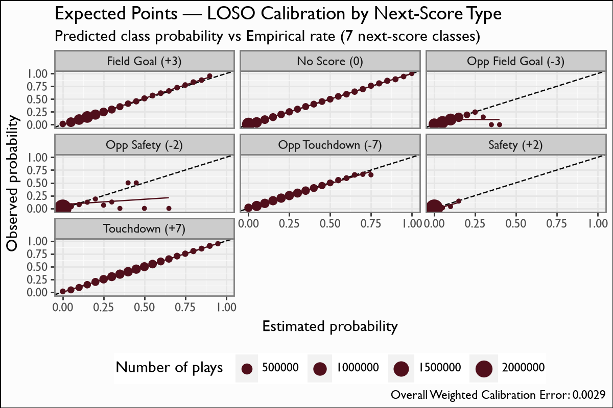
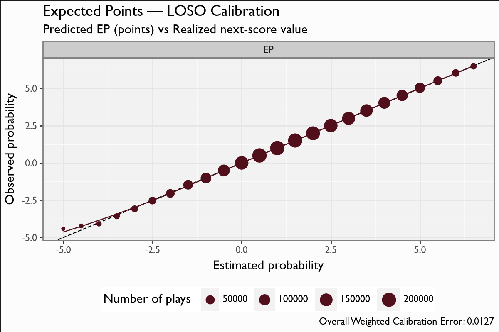

# Expected Points (EP)

## Overview

The Expected Points (EP) model estimates the expected next-score value for the team in possession at the **start of a play**, given game state. It is the foundation of the whole CFB analytics stack: EP differences between consecutive plays define **Expected Points Added (EPA)**, which in turn feeds the QBR model and the RB-evaluation (xREPA) surface. Downstream, every play-by-play row carries an `ep` column plus the seven class probabilities.

## Model features

The EP model uses **8 features**, all known at the **start of the play** — no look-ahead. Each row is one scrimmage play; the label is the *next scoring event* in the same half.

| Feature | Type | What it encodes |
|---|---|---|
| `TimeSecsRem` | numeric | Seconds remaining in the half — late-half plays have fewer expected possessions left to score. |
| `yards_to_goal` | numeric | Distance (1-99) to the opponent's end zone — the single strongest field-position signal. |
| `distance` | numeric | Yards to go for a first down. |
| `down_1` … `down_4` | one-hot | Current down, one-hot encoded (4 columns) so the tree can split cleanly on each down. |
| `pos_score_diff_start` | numeric | Possession-team score differential — late-game score state shifts play-calling and therefore next-score expectation. |

## Recipe & lineage

An 8-feature XGBoost **multiclass softprob** model over **7 next-score classes** (touchdown for/against, field goal for/against, safety for/against, no-score). Class probabilities are collapsed to a single EP via the point-value map `{0:+7, 1:-7, 2:+3, 3:-3, 4:+2, 5:-2, 6:0}`. The recipe is a faithful port of the cfbscrapR / `keepers` EP model. Features: `TimeSecsRem`, `yards_to_goal`, `distance`, one-hot `down_1..down_4`, and `pos_score_diff_start`. Retrained on the **full 2004-2025 history (2,219,607 plays)** with the shipped hyperparameters unchanged.

## The model

**Algorithm.** XGBoost gradient-boosted trees, `objective=multi:softprob` over `num_class=7`, `eval_metric=mlogloss`. **525 boosting rounds**, `eta=0.025`, `max_depth=5`, `subsample=0.8`, `colsample_bytree=0.8`, `gamma=1`, `min_child_weight=1` — the exact cfbscrapR / `keepers` hyperparameters, unchanged. Rows are weighted by `ScoreDiff_W` (the cfbscrapR score-differential weighting). The 7 class probabilities are dotted with the point map `{0:+7, 1:-7, 2:+3, 3:-3, 4:+2, 5:-2, 6:0}` to produce a scalar EP.

**Evaluation.** Honest **leave-one-season-out (LOSO)** cross-validation: for each of the 22 seasons (2004-2025) we retrain on the *other* 21 seasons and predict the held-out one, then pool the out-of-fold predictions. No play is ever scored by a model that saw its season in training.

## Metrics

| metric | value |
|---|---|
| `n` | 2219607 |
| `ep_cal_mae` | 0.0141 |
| `mean_pred_ep` | 1.6888 |
| `mean_realized` | 1.6891 |
| `mlogloss_pooled` | 1.2333 |
| `accuracy_pooled` | 0.4997 |

## Calibration Results

## Discussion

Metrics are pooled **leave-one-season-out (LOSO)** out-of-fold predictions — for each season we train on every *other* season and predict the held-out one, so the numbers are honest out-of-sample. Pooled `mlogloss` 1.2333 and top-1 accuracy 0.4997 are strong for a 7-way score-outcome problem where the modal outcome (no score / TD-for) is inherently noisy. The headline calibration number is the **EP calibration MAE of 0.014 points**: binned predicted EP tracks realized next-score value almost exactly (`mean_pred_EP == mean_realized == 1.689`). The calibration figure plots binned predicted EP against realized next-score value against the y=x line.

## Feature importance

By XGBoost gain, `yards_to_goal` dominates (field position is the backbone of EP), followed by `TimeSecsRem` and `pos_score_diff_start`; the down one-hots and `distance` refine the surface within a given field position. This ordering matches the cfbscrapR EP model and the nflfastR EP post.

## Limitations

EP is a *start-of-play* quantity; it does not know the result of the current play (that is what EPA captures). Top-1 accuracy near 0.50 reflects irreducible outcome noise, not miscalibration — the model is well-calibrated in aggregate even where individual-play outcomes are unpredictable. The 7-class point map is fixed (no 2-point-conversion modelling beyond the safety/defensive-score classes), and the model is blind to weather, personnel, and in-play participants by design.

## Provenance

| metric | value |
|---|---|
| `features` | TimeSecsRem, yards_to_goal, distance, down_1, down_2, down_3, down_4, pos_score_diff_start |
| `hyperparameters` | {} |
| `training_seasons` | n/a |
| `trained_date` | 2026-06-17 |
| `xgboost_version` | 3.2.0 |
