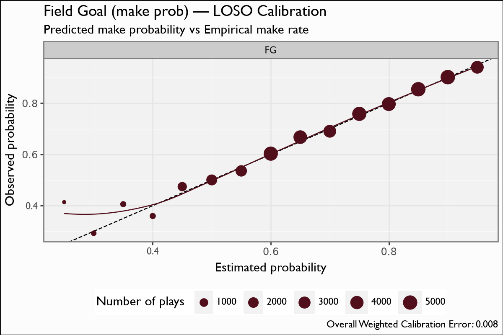

# Field Goal (make prob)

## Overview

The field-goal model estimates the probability a placekick is **made**, given only the kick distance. The single input is `yards_to_goal` (the kick distance is `yards_to_goal + 17`). It is **bundled in sdv-py** and powers the field-goal branch of the fourth-down decision surface: the expected value of attempting a field goal is this make probability times three points.

## Model features

**1 feature**; one row per field-goal attempt. The binary label is `fg_made`.

| Feature | Type | What it encodes |
|---|---|---|
| `yards_to_goal` | numeric | Field position of the snap; the kick distance is `yards_to_goal + 17`. The **only** input — distance is everything for a placekick. |

## Recipe & lineage

A **1-feature** XGBoost **binary:logistic** make-probability model over **42,589 attempts** (~73% make rate), **60 trees**. Distance is everything — with one feature the model *is* the empirical make-rate-by-distance curve, smoothed by the boosting. LOSO weighted calibration error is **0.0085**: binned predicted make probability equals the empirical make rate to three decimals at every distance.

## The model

**Algorithm.** XGBoost, `objective=binary:logistic`, `eval_metric=logloss`, **60 boosting rounds**, `max_depth=3`, `eta=0.1`, `subsample=0.8`, `min_child_weight=30`. The predicted probability is the make probability; the fourth-down FG expected value is `3 * P(make)`.

**Evaluation.** Leave-one-season-out over 2004-2025 (42,589 attempts): train on the other seasons, predict the held-out one, pool the out-of-fold make probabilities. The pooled weighted calibration error is **0.0085** — predicted equals actual to three decimals at every distance.

**Rule-era variant (adopted, modest).** Adding the one-hot era dummies (`era0..era3`) gives a small but consistent out-of-fold gain — pooled LOSO logloss **0.5258 → 0.5240**. Shipped side-by-side as `fg_era.ubj` (yards_to_goal + era0..era3).

## Metrics

| metric | value |
|---|---|
| `n` | 42615 |
| `logloss` | 0.5247 |
| `brier` | 0.1749 |
| `auc` | 0.7106 |
| `base_rate` | 0.733 |
| `weighted_cal_err` | 0.008 |
| `weighted_cal_err_loso` | 0.0085 |

## Calibration Results

## Discussion

Metrics are pooled **leave-one-season-out (LOSO)** out-of-fold predictions over 2004-2025. The headline number is the **weighted calibration error of 0.0085** — the predicted make probabilities are essentially exact across the whole distance range. The calibration figure bins the predicted make probability into 0.05 buckets and plots it against the empirical make rate (point size = n, y=x reference); because the lone feature is distance, this doubles as the make-prob-vs-distance curve.

## Feature importance

There is only one feature, so importance is trivial: `yards_to_goal` carries 100% of the signal. The interpretable view is the monotone-decreasing make-probability curve the model traces as distance grows.

## Limitations

The model is blind to everything except distance — no kicker identity, no weather, no wind, no surface, no snap/hold quality. Long attempts are thin in the data, so the fit **extrapolates past ~59 yards** on very few examples and should be read with caution there. Because it is distance-only, it captures the league-average make curve, not a particular kicker's leg.

## Provenance

| metric | value |
|---|---|
| `features` | yards_to_goal |
| `hyperparameters` | {"objective":"binary:logistic","eval_metric":"logloss","max_depth":3,"eta":0.1,"subsample":0.8,"min_child_weight":30} |
| `training_seasons` | n/a |
| `trained_date` | 2026-06-22 |
| `xgboost_version` | 3.2.0 |
