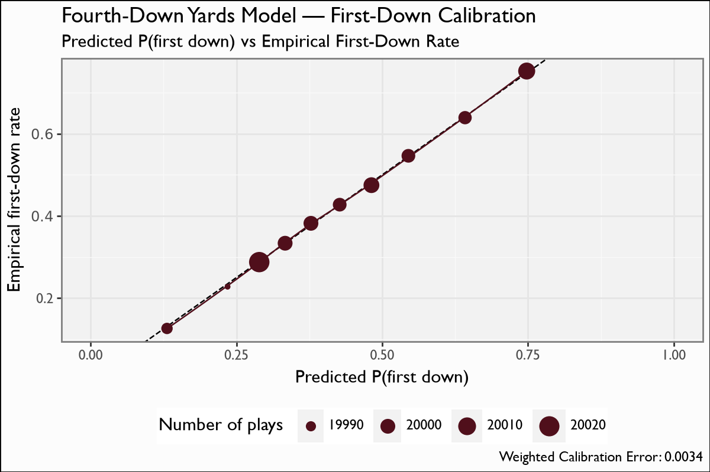
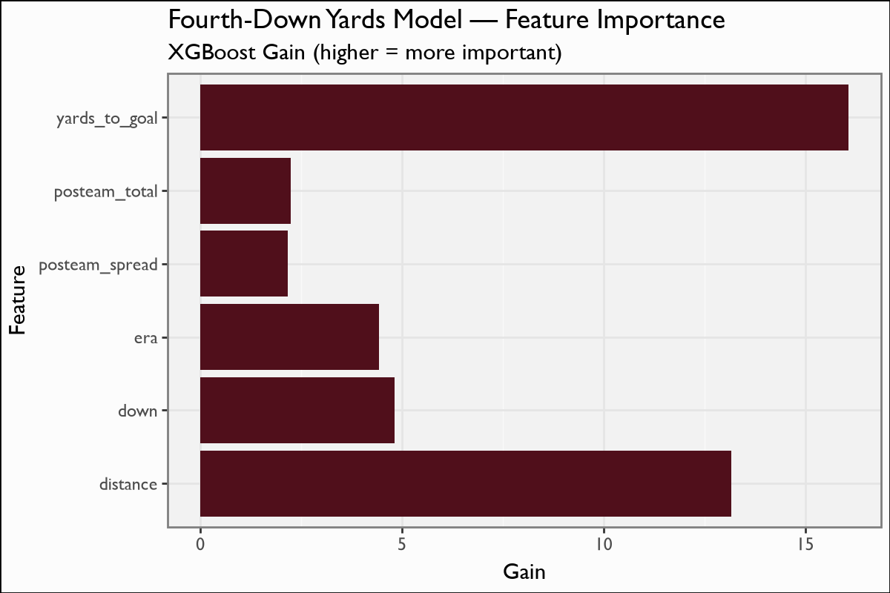

# Fourth-Down Yards

## Overview

The fourth-down yards model predicts the **distribution of yards gained** on a go-for-it (or third-down) attempt, which feeds the fourth-down decision surface (go / punt / field-goal expected-value comparison). From the gain distribution we derive P(first down) for any distance-to-go.

## Model features

**6 features**; one row per scrimmage (3rd/4th-down) play. The label is the integer yards gained, shifted into 76 ordinal classes (-10..65).

| Feature | Type | What it encodes |
|---|---|---|
| `down` | numeric | Current down (3 or 4). |
| `distance` | numeric | Yards to go — the conversion threshold. |
| `yards_to_goal` | numeric | Field position (compresses the gain distribution near the goal line). |
| `posteam_total` | numeric | Possession-team game total (proxy for offensive quality / pace). |
| `posteam_spread` | numeric | Possession-team spread (game-script context). |
| `era` | ordinal | CFB rule era (0:&le;2006, 1:2007-13, 2:2014-17, 3:&ge;2018) — captures rule changes affecting conversion rates. **Ranks 4th by gain.** |

## Recipe & lineage

A 6-feature XGBoost **multiclass softprob** over **76 classes** (integer gains -10..65), **157 rounds**. Lineage is the cfb4th model plus an added **ordinal CFB rule-era factor** `era` (0:&le;2006, 1:2007-13, 2:2014-17, 3:&ge;2018) that captures rule changes affecting conversion rates. Features: `down`, `distance`, `yards_to_goal`, `posteam_total`, `posteam_spread`, `era`. Notably **`era` is the 4th-most-important feature by gain** — the rule-era signal matters.

## The model

**Algorithm.** XGBoost, `objective=multi:softprob` over **76 classes** (integer gains -10..65), **157 boosting rounds**. Lineage is the cfb4th yards model plus the added ordinal `era` factor. P(first down) for any distance-to-go is recovered by summing class probabilities for gains &ge; the distance.

**Evaluation.** Calibration collapses the 76-class distribution into P(first down) and compares to the empirical conversion rate over the 2.2M-play corpus (a sampled subset for the figure). This is a fit/calibration check on the full corpus rather than a season-held-out LOSO pass.

## Metrics

| metric | value |
|---|---|
| `importance_top` | yards_to_goal:16.0814, distance:13.1751, down:4.811, era:4.426, posteam_total:2.238, posteam_spread:2.1692 |
| `first_down_cal_mae` | 0.005 |

## Calibration Results

## Discussion

Calibration is evaluated by collapsing the 76-class gain distribution into **P(first down)** (sum of class probabilities for gains &ge; distance-to-go) and comparing to the empirical first-down rate. On the 2.2M-play corpus the **first-down calibration MAE is 0.005** — the predicted conversion probabilities are almost exactly right. The report renders two figures: the first-down calibration scatter and the feature-importance bar chart (where `era` ranks 4th).

## Feature importance

By XGBoost gain: `distance` leads (it *is* the conversion threshold), then `yards_to_goal` and the team total/spread context; **`era` ranks 4th** — confirming the rule-era signal is real, not decorative. The feature-importance bar chart is rendered alongside the calibration plot.

## Limitations

The label is `statYardage` — ESPN's recorded yards gained — which can disagree with official play-by-play on penalty-laden or laterals plays, adding label noise at the tails of the gain distribution. The model covers gains -10..65; rare plays outside that window are clipped. It predicts a *yardage* distribution, not the binary go/no-go decision itself — the decision EV is computed downstream by combining this distribution with the EP/WP surfaces.

## Provenance

| metric | value |
|---|---|
| `features` | down, distance, yards_to_goal, posteam_total, posteam_spread, era |
| `hyperparameters` | {"booster":"gbtree","objective":"multi:softprob","eval_metric":"mlogloss","num_class":76,"eta":0.07,"gamma":4.325037e-09,"subsample":0.5385424,"colsample_bytree":0.6666667,"max_depth":4,"min_child_weight":7} |
| `training_seasons` | n/a |
| `trained_date` | 2026-06-22 |
| `xgboost_version` | 3.2.0 |
