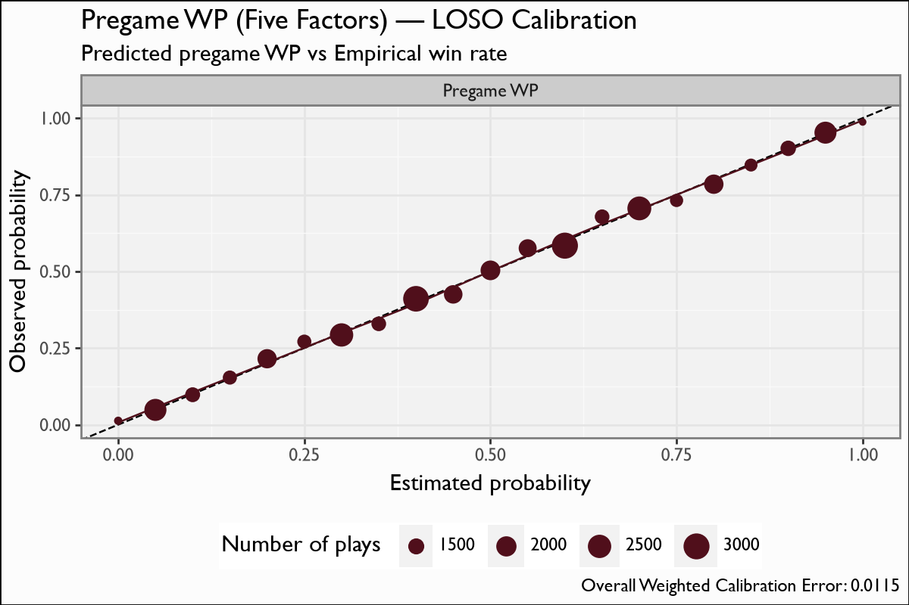

# Pregame WP (Five Factors)

## Overview

The pregame Win Probability model (Track 4, the **Five Factors** surface) forecasts a matchup's outcome from a single composite team-quality signal. It regresses the **Five-Factors rating differential** (`5FRDiff` — the gap between the two teams' composite of efficiency, explosiveness, field position, finishing drives, and turnovers) onto the realized game point margin (`PtsDiff`), then converts the predicted margin to a win probability via a Gaussian transform. It is the pregame analogue of the in-game WP heads: no game state, just team strength.

## Model features

**1 feature**; one row per team-game box score. The regression target is `PtsDiff` (game point margin); the win label `win` is used only for the WP calibration.

| Feature | Type | What it encodes |
|---|---|---|
| `5FRDiff` | numeric | The difference between the two teams' **Five-Factors** composite rating — efficiency, explosiveness, field position, finishing drives, and turnovers rolled into one number. The **only** input: a single team-quality gap. |

## Recipe & lineage

An XGBoost **regression** (`5FRDiff` → `PtsDiff`), **10 trees**, fit on **37,774 team-game box scores (2005-2025)** built from CFBD play/drive data via the 5-factor box-score pipeline. The predicted point margin is mapped to a win probability with the Gaussian transform **`WP = Phi(pred_PtsDiff / std)`** (`mu = 0`, `std = 16.46`, stored in the card). A single composite factor explains **R² 0.535** of margin variance — over half — and the resulting WP carries a LOSO weighted calibration error of just **0.0115**. It is a Track-4 **analytic artifact** and is **not bundled into sdv-py**.

## The model

**Algorithm.** XGBoost **regression** (squared-error objective), **10 boosting rounds**, mapping `5FRDiff` → `PtsDiff` (game point margin). The point-margin prediction is converted to a win probability with the Gaussian transform **`WP = Phi(pred_PtsDiff / std)`**, `mu = 0`, `std = 16.46` (both stored in the model card). Trained on **37,774 team-game box scores (2005-2025)**.

**Evaluation.** Leave-one-season-out over 2005-2025: train on the other seasons, predict the held-out one, pool the out-of-fold values. The point-margin fit reaches **R² 0.535**, and the Gaussian-transformed win probability has a **weighted calibration error of 0.0115** (Brier 0.1698, win base rate 0.500) — the single-panel calibration figure plots binned predicted pregame WP against the empirical win rate.

## Metrics

| metric | value |
|---|---|
| `n` | 37774 |
| `logloss` | 0.5056 |
| `brier` | 0.1698 |
| `auc` | 0.8261 |
| `base_rate` | 0.5 |
| `weighted_cal_err` | 0.0115 |
| `weighted_cal_err_loso` | 0.0115 |
| `pts_diff_r2_loso` | 0.535 |

## Calibration Results

## Discussion

Metrics are pooled **leave-one-season-out (LOSO)** out-of-fold predictions over 2005-2025, so they are honest out-of-sample. The single `5FRDiff` feature recovers **PtsDiff R² 0.535** — one composite rating explains ~54% of point-margin variance — and the Gaussian-transformed win probability is well-calibrated: **WP weighted calibration error 0.0115**, **Brier 0.1698** against a **0.500 win base rate**. The single-panel calibration figure bins predicted pregame WP into 0.05 buckets and plots it against the empirical win rate (point size = n, y=x reference). In application the model is fed a team's *recent-average* 5FR to forecast a future opponent; the fitted object itself is the same-game `5FRDiff` → `PtsDiff` relationship.

## Feature importance

There is a single feature, so importance is trivial: `5FRDiff` carries 100% of the signal. The interpretable view is the near-linear `5FRDiff` → `PtsDiff` response (and the monotone WP curve it induces through the Gaussian transform) — a ~16.5-point margin standard deviation means a one-rating-point edge moves the win probability only modestly, which is why even an R² of 0.54 leaves substantial game-to-game noise.

## Limitations

The model rests on a **single composite feature**, so it cannot resolve matchup detail beyond the rating gap — it is a strong baseline, not a play-level forecaster. The fit is **explanatory** (same-game `5FRDiff` vs same-game margin); the *pregame* use applies a team's **recent-average** 5FR to a future game, which shifts the distribution the fit never saw, so live forecasts are looser than the in-sample R² suggests. The 5FR inputs are **CFBD-sourced**, so coverage is **FBS-only**. Because it is a Track-4 analytic artifact, it ships only here with the model program and is **not bundled into sdv-py**.

## Provenance

| metric | value |
|---|---|
| `features` | 5FRDiff |
| `hyperparameters` | {} |
| `training_seasons` | n/a |
| `trained_date` | 2026-06-22 |
| `xgboost_version` | 3.2.0 |
