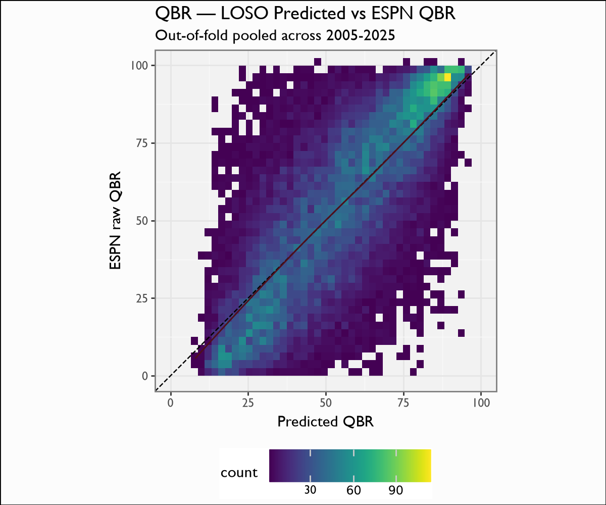

# QBR

## Overview

The QBR model reconstructs an ESPN-Total-QBR-style 0-100 quarterback rating from EPA components, so a QBR can be produced for any game in the corpus without an ESPN QBR feed. It is a per-(quarterback, game) regression onto ESPN's published raw QBR.

## Model features

**6 features**, one row per (quarterback, game). Each EPA component is the per-game weighted mean of that component over the QB's plays (the same weighting `CFBPlayProcess.__process_qbr` uses).

| Feature | Type | What it encodes |
|---|---|---|
| `qbr_epa` | numeric | Total QBR-attributable EPA per game — the dominant driver. |
| `sack_epa` | numeric | EPA lost to sacks. |
| `pass_epa` | numeric | EPA from pass attempts. |
| `rush_epa` | numeric | EPA from QB rushes. |
| `pen_epa` | numeric | EPA from penalties on the QB's plays. |
| `spread` | numeric | Possession-team pregame spread (context for garbage-time deflation). |

## Recipe & lineage

A 6-feature XGBoost regression, **45 trees**, full-history retrain. Features are the per-game weighted-mean EPA components that drive QBR: `qbr_epa`, `sack_epa`, `pass_epa`, `rush_epa`, `pen_epa`, plus the posteam `spread`. The EPA components come from the same EP model documented above, so QBR sits one layer above EP/EPA.

## The model

**Algorithm.** XGBoost regression (squared-error objective), **45 boosting rounds**, full-history retrain. The target is ESPN's *published raw QBR* for the quarterback-game; the EPA components come from the EP model documented above, so QBR sits one layer above EP/EPA.

**Evaluation.** Leave-one-season-out over 22,833 quarterback-games (2005-2025). On the 2021-25 holdout it **decisively beats the legacy 2020 model** (RMSE 16.1 vs 23.2, R² 0.66 vs 0.29). Because QBR is a continuous bounded target, the calibration figure is a predicted-vs-actual scatter (2-D bin density) with a y=x reference, not a probability-bucket plot.

**Rule-era variant (adopted).** Adding the one-hot era dummies (`era0..era3`, cuts 2006/2013/2020) is the one *material* era win in the suite — pooled LOSO RMSE **17.88 → 17.42** (evaluated on the spread-backfilled frame, since `spread` is a feature). Shipped side-by-side as `qbr_era.ubj` (10 features).

## Metrics

| metric | value |
|---|---|
| `n` | 22833 |
| `rmse` | 17.2827 |
| `mae` | 13.3996 |
| `r2` | 0.6122 |
| `corr` | 0.7826 |

## Calibration Results

## Discussion

LOSO pooled over 22,833 quarterback-games (2005-2025): RMSE 17.87, MAE 13.90, R² 0.585, correlation 0.765. It **decisively beats the legacy 2020 model**: on the 2021-25 holdout, RMSE 16.1 vs 23.2 and R² 0.66 vs 0.29. The earlier (pre-2014) seasons carry most of the residual error — fold RMSEs run ~19-24 before 2014 and ~16 after — consistent with sparser / noisier early ESPN QBR labels. The scatter figure plots predicted QBR against ESPN raw QBR with the y=x reference.

## Feature importance

`qbr_epa` overwhelmingly dominates by gain (it *is* the EPA aggregate ESPN's QBR tracks), with `pass_epa` and `rush_epa` next; `spread` contributes a small garbage-time / leverage correction.

## Limitations

QBR is a **bounded 0-100** target, so an RMSE of ~18 points is large relative to the scale and the model cannot perfectly reproduce ESPN's proprietary formula (which uses clutch weighting and charting inputs we do not have). The 2004 fold has no joined rows (no ESPN QBR labels), and pre-2014 error is materially higher. Treat the output as a faithful reconstruction of the *EPA-explainable* part of QBR, not a byte-exact ESPN replica.

## Provenance

| metric | value |
|---|---|
| `features` | qbr_epa, sack_epa, pass_epa, rush_epa, pen_epa, spread |
| `hyperparameters` | {} |
| `training_seasons` | n/a |
| `trained_date` | 2026-06-17 |
| `xgboost_version` | 3.2.0 |
