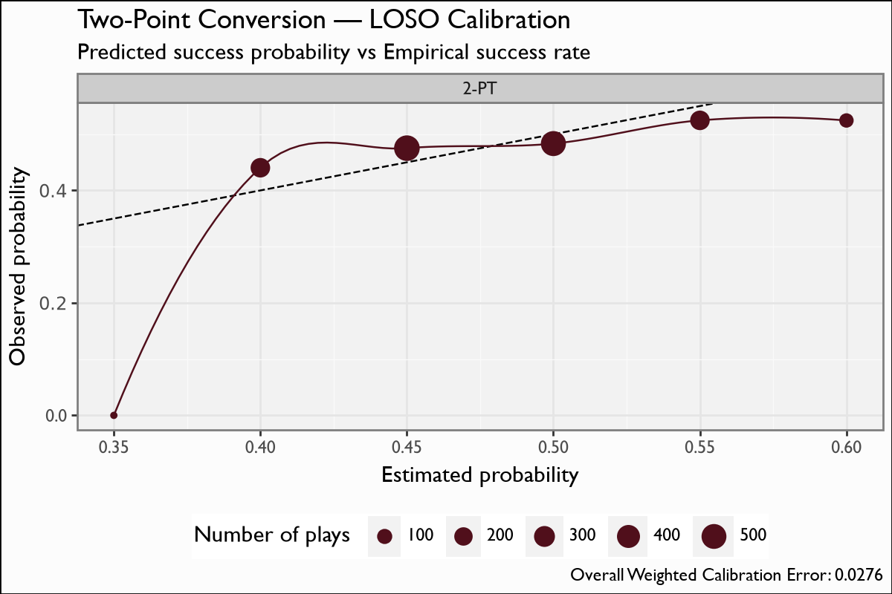

# Two-Point Conversion

## Overview

The two-point-conversion model estimates the probability a two-point attempt **succeeds**, given game context. It powers the **go-for-2 vs. extra-point** decision (`add_2pt_probs`): the model's success probability times two points is compared against the extra-point expected value, where the XP make rate is the empirical CFB rate **0.9851**.

## Model features

**4 features**; one row per two-point attempt. The binary label is `two_point_success`.

| Feature | Type | What it encodes |
|---|---|---|
| `posteam_spread` | numeric | Possession-team pregame spread (team-strength proxy). |
| `posteam_total` | numeric | Possession-team game total (offensive-quality proxy). |
| `pos_score_diff` | numeric | Possession-team score differential (game-script context). |
| `era` | ordinal | CFB rule era (level shift in conversion rate). |

## Recipe & lineage

A **4-feature** XGBoost **binary:logistic** success-probability model over **1,622 attempts**, **40 trees**, ~**48.2% base rate**. Features are game-context only: `posteam_spread`, `posteam_total`, `pos_score_diff`, `era`. The model is **near-constant** — its predictions range just **0.39-0.60**, capturing slight game-context variation around the base rate rather than the flat 0.45 cfb4th uses. LOSO weighted calibration error is **0.028**.

## The model

**Algorithm.** XGBoost, `objective=binary:logistic`, `eval_metric=logloss`, **40 boosting rounds**, `max_depth=2`, `eta=0.05`, `subsample=0.9`, `min_child_weight=40` — a deliberately shallow fit for a 1,622-row target. Predictions span just **0.39-0.60** around the **~48.2% base rate**.

**Evaluation.** Leave-one-season-out, pooled out-of-fold. Weighted calibration error **0.028**. The single-panel calibration figure is sparse because the model is near-constant — the faithful picture for a tiny sample. It feeds the go-for-2 vs. XP decision against the empirical XP make rate **0.9851**.

## Metrics

| metric | value |
|---|---|
| `n` | 1622 |
| `logloss` | 0.6918 |
| `brier` | 0.2493 |
| `auc` | 0.5319 |
| `base_rate` | 0.4821 |
| `weighted_cal_err` | 0.0276 |
| `weighted_cal_err_loso` | 0.028 |

## Calibration Results

## Discussion

Metrics are pooled **leave-one-season-out (LOSO)** out-of-fold predictions. With only 1,622 attempts the surface is deliberately shallow (depth-2 trees), and the predictions hug the **~48% base rate** (range 0.39-0.60). The pooled weighted calibration error is **0.028** — looser than the high-volume heads, as expected from the tiny, noisy sample. The single-panel calibration figure bins predicted vs. actual success; it is **sparse** because the predictions are near-constant, which is the honest picture for a 1.6K-attempt target.

## Feature importance

By XGBoost gain the game-context features (`posteam_total`, `posteam_spread`, `pos_score_diff`) carry what little structure the 1,622-attempt sample supports, with `era` a coarse level shift. Because the model is near-constant, no single feature moves the prediction far from the ~48% base rate.

## Limitations

The sample is **tiny** (1,622 attempts), so the model is **near-constant** and cannot resolve fine context — treat it as a slightly-context-adjusted base rate, not a sharp per-play estimate. It has **no air-yards, play-call, or personnel** inputs and no defensive context. The calibration bins are sparse by construction; the decision it feeds (go-for-2 vs. XP) is therefore driven mostly by the ~48% level against the 0.9851 XP make rate, with only small game-context tilts.

## Provenance

| metric | value |
|---|---|
| `features` | posteam_spread, posteam_total, pos_score_diff, era |
| `hyperparameters` | {"objective":"binary:logistic","eval_metric":"logloss","max_depth":2,"eta":0.05,"subsample":0.9,"min_child_weight":40} |
| `training_seasons` | n/a |
| `trained_date` | 2026-06-22 |
| `xgboost_version` | 3.2.0 |
