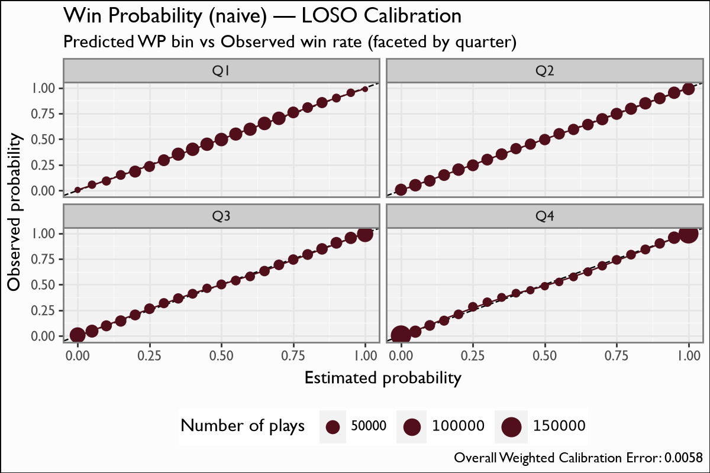

# Win Probability (naive)

## Overview

The naive Win Probability model answers *given only the game state, with no betting-market information, how likely is the possession team to win?* It is the spread model's sibling — identical except it drops the spread signal — and is the right surface when a pregame spread is unavailable or when you explicitly want a market-free WP.

## Model features

**12 features** — exactly the spread model's set **minus `spread_time`**. Everything else is shared: `TimeSecsRem`, `adj_TimeSecsRem`, `ExpScoreDiff_Time_Ratio`, `pos_score_diff_start`, `down`, `distance`, `yards_to_goal`, `is_home`, both teams' remaining timeouts, `period`, and `pos_team_receives_2H_kickoff`. Dropping the single market feature is the *only* difference between the two WP heads, which is why they can be compared head-to-head.

## Recipe & lineage

A 12-feature XGBoost **binary:logistic** model, **65 trees**. The feature set is exactly the spread model's **minus `spread_time`**; everything else (game clock, score differential, field position, down/distance, timeouts, period, 2H-kickoff possession) is shared. Far fewer trees than the spread model (65 vs 760) because without the spread there is less structured signal to fit.

## The model

**Algorithm.** XGBoost, `objective=binary:logistic`, **65 boosting rounds**, `eta=0.2`, `max_depth=4`, `subsample=0.8`, `colsample_bytree=0.8` — far fewer trees than the spread model (65 vs 760) because, without the spread, there is less structured signal to fit and the model saturates earlier.

**Evaluation.** Leave-one-season-out over 2004-2025, pooled out-of-fold, faceted by quarter — the same protocol as the spread model, so the two are directly comparable.

## Metrics

| metric | value |
|---|---|
| `n` | 2219607 |
| `logloss` | 0.4015 |
| `brier` | 0.1332 |
| `auc` | 0.8934 |

## Calibration Results

## Discussion

Metrics are pooled **leave-one-season-out (LOSO)** out-of-fold predictions (the naive variant now gets its own LOSO pass, identical in protocol to the spread model). The naive WP **correlates ~0.94 with the spread WP** and, as expected, the two **diverge most in the first quarter** — when the pregame spread carries the most information and the game state carries the least. By the fourth quarter the mean absolute gap between naive and spread WP collapses (Q1 ~0.13 vs Q4 ~0.02), because `spread_time` has decayed away and both models are reading the same near-final game state. The calibration figure facets by quarter, the same cfbscrapR recipe as the spread model.

## Feature importance

Without the market prior, `pos_score_diff_start`, `yards_to_goal` and the clock terms carry the model from the opening kickoff; this is precisely why the naive WP is least confident (closest to 0.5) early and why it diverges most from the spread WP in Q1.

## Limitations

Because it ignores the market, the naive model is *less sharp* early in games: its log-loss and Brier are worse than the spread model's (it has strictly less information). It is the correct tool only when you want a spread-free WP or lack a spread; for forecasting accuracy when a spread exists, prefer the spread model. WPA (the first difference of WP) carries the same per-play noise caveat as the spread model.

## Provenance

| metric | value |
|---|---|
| `features` | pos_team_receives_2H_kickoff, TimeSecsRem, adj_TimeSecsRem, ExpScoreDiff_Time_Ratio, pos_score_diff_start, down, distance, yards_to_goal, is_home, pos_team_timeouts_rem_before, def_pos_team_timeouts_rem_before, period |
| `hyperparameters` | {} |
| `training_seasons` | n/a |
| `trained_date` | 2026-06-22 |
| `xgboost_version` | 3.2.0 |
