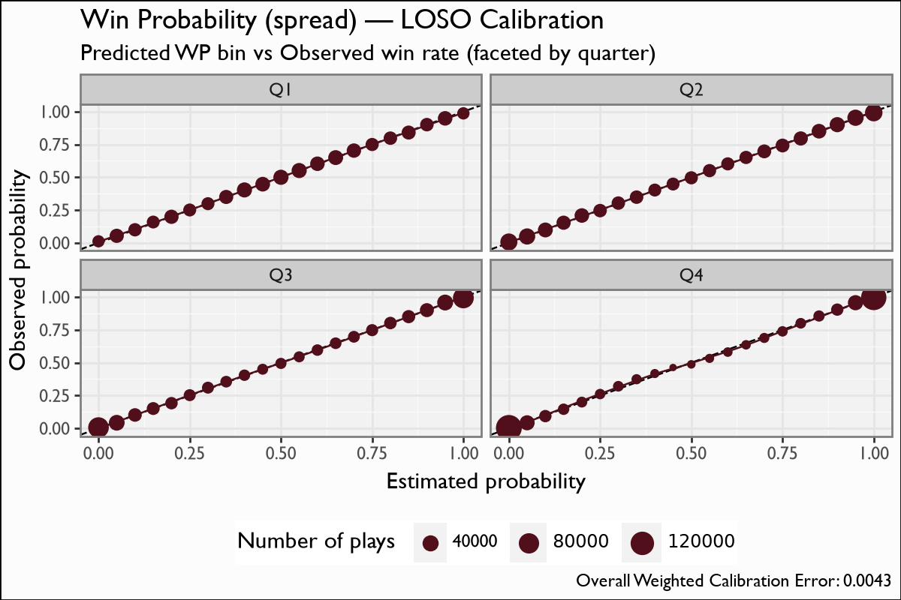

# Win Probability (spread)

## Overview

The spread-aware Win Probability model estimates the probability that the team in possession wins the game, given game state **and the pregame point spread**. It produces the `vegas_wp`-style surface; consecutive-play differences define **Win Probability Added (WPA)**.

## Model features

**13 features**, all start-of-play. The binary label is `win_indicator = (possession team == game winner)`. The signature feature is the spread-decay term.

| Feature | Type | What it encodes |
|---|---|---|
| `spread_time` | numeric | `pos_team_spread * exp(-4 * elapsed_share)` — the pregame spread decayed toward 0 as the clock runs; its influence vanishes by Q4. **The market signal.** |
| `TimeSecsRem` | numeric | Seconds remaining in the half. |
| `adj_TimeSecsRem` | numeric | Game-clock-adjusted time remaining (half-aware). |
| `ExpScoreDiff_Time_Ratio` | numeric | Expected score differential scaled by time — a momentum/urgency interaction. |
| `pos_score_diff_start` | numeric | Possession-team score differential. |
| `down` | numeric | Current down. |
| `distance` | numeric | Yards to go. |
| `yards_to_goal` | numeric | Field position. |
| `is_home` | binary | Home-field indicator for the possession team. |
| `pos_team_timeouts_rem_before` | numeric | Possession-team timeouts left. |
| `def_pos_team_timeouts_rem_before` | numeric | Defense timeouts left. |
| `period` | numeric | Quarter (1-4+). |
| `pos_team_receives_2H_kickoff` | binary | Whether the possession team gets the second-half kickoff — a known WP edge. |

## Recipe & lineage

A 13-feature XGBoost **binary:logistic** model, **760 trees**, a faithful port of the `cfbscrapR-wpa.ipynb` recipe. The signature feature is `spread_time = pos_team_spread * exp(-4 * elapsed_share)` — the pregame spread decayed toward zero as the game clock runs out, so its influence vanishes by the fourth quarter. Other features: `TimeSecsRem`, `adj_TimeSecsRem`, `ExpScoreDiff_Time_Ratio`, `pos_score_diff_start`, `down`, `distance`, `yards_to_goal`, `is_home`, both teams' remaining timeouts, `period`, and `pos_team_receives_2H_kickoff`.

## The model

**Algorithm.** XGBoost, `objective=binary:logistic`, `eval_metric=logloss`, **760 boosting rounds**, `eta=0.02`, `max_depth=5`, `min_child_weight=14`, `subsample=0.72`, `colsample_bytree=0.57`, `gamma=0.34` — the exact `cfbscrapR-wpa.ipynb` recipe, unchanged. No sample weights (per the cfbscrapR WPA recipe).

**Evaluation.** Leave-one-season-out over 2004-2025: train on 21 seasons, predict the held-out one, pool the out-of-fold win probabilities. The calibration figure **facets by quarter** (the cfbscrapR `03-WPA-Model.R` recipe) so you can confirm calibration holds late in games, where WP is most actionable.

## Metrics

| metric | value |
|---|---|
| `n` | 2219660 |
| `logloss` | 0.3486 |
| `brier` | 0.1135 |
| `auc` | 0.9223 |
| `weighted_cal_err_pooled` | 0.0147 |

## Calibration Results

## Discussion

LOSO pooled: `logloss` 0.3616, Brier 0.1182, AUC 0.9159, weighted calibration error 0.0147. The AUC near 0.92 and the sub-0.015 weighted calibration error mean the predicted win probabilities are both discriminating and well-calibrated across the whole probability range. The calibration figure facets by quarter so you can confirm calibration holds late in games (where WP is most actionable).

## Feature importance

`spread_time` and the time/score-differential terms carry the model early in games; as `spread_time` decays, `pos_score_diff_start`, `yards_to_goal` and the clock terms take over. This is exactly the intended hand-off from market prior to live game state.

## Limitations

WPA — the first difference of WP — is intrinsically noisy: small per-play WP movements are dominated by model variance, so single-play WPA should be read as a directional signal, not a precise quantity. The spread input is a pregame number; the model does not re-estimate a live spread. Overtime and end-of-half edge cases are handled by the construction pipeline upstream, not by the model head.

## Provenance

| metric | value |
|---|---|
| `features` | pos_team_receives_2H_kickoff, spread_time, TimeSecsRem, adj_TimeSecsRem, ExpScoreDiff_Time_Ratio, pos_score_diff_start, down, distance, yards_to_goal, is_home, pos_team_timeouts_rem_before, def_pos_team_timeouts_rem_before, period |
| `hyperparameters` | {} |
| `training_seasons` | n/a |
| `trained_date` | 2026-06-17 |
| `xgboost_version` | 3.2.0 |
