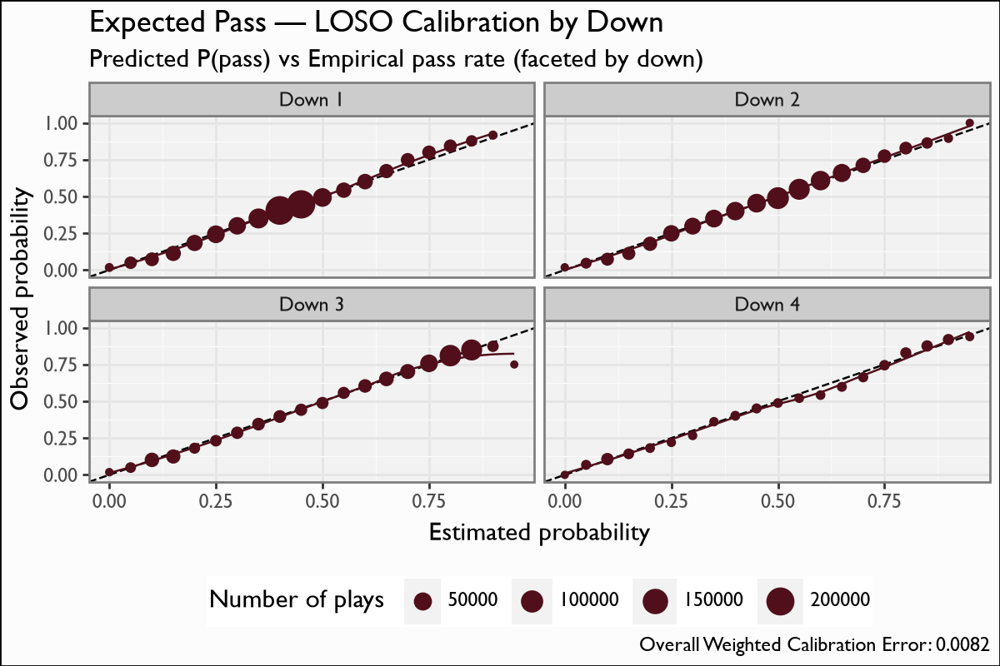

# Expected Pass

## Overview

The expected-pass model estimates the probability that a scrimmage play is a **dropback (pass)** given pre-snap game state — a measure of how *predictable* an offense's tendency is in a given situation. It is the CFB analogue of the nflfastR xpass surface, where **`pass_oe = 100 * (pass - xpass)`** is the pass-rate over expected: positive when an offense passes more than situation-average.

## Model features

**7 features**, all pre-snap; one row per scrimmage play. The binary label is `is_pass` (dropback).

| Feature | Type | What it encodes |
|---|---|---|
| `down` | numeric | Current down — **the dominant tendency driver** (gain 830). |
| `distance` | numeric | Yards to go — second by gain (592); long-distance ⇒ pass. |
| `period` | numeric | Quarter (gain 381); late-game script shifts tendency. |
| `pos_score_diff` | numeric | Possession-team score differential (gain 240); trailing teams pass. |
| `TimeSecsRem` | numeric | Seconds remaining in the half (gain 214). |
| `yards_to_goal` | numeric | Field position (gain 174); red-zone/own-territory tendency. |
| `era` | ordinal | CFB rule era (gain 26); a coarse level shift in pass rate. |

## Recipe & lineage

A **7-feature** XGBoost **binary:logistic** dropback-probability model over **1.9M scrimmage plays** (1,902,317 rows), **150 trees**. Features are the pre-snap situation: `down`, `distance`, `yards_to_goal`, `pos_score_diff`, `TimeSecsRem`, `era`, `period`. **Down dominates** by gain (830) — down/distance is the backbone of play-calling tendency. LOSO weighted calibration error is **0.0073**.

## The model

**Algorithm.** XGBoost, `objective=binary:logistic`, `eval_metric=logloss`, **150 boosting rounds**, `max_depth=5`, `eta=0.1`, `subsample=0.8`, `colsample_bytree=0.8`, `min_child_weight=20`. The predicted probability is `xpass`; **`pass_oe = 100 * (pass - xpass)`** is the pass-rate-over-expected residual.

**Evaluation.** Leave-one-season-out over 2004-2025 (1.9M plays): train on the other seasons, predict the held-out one, pool the out-of-fold probabilities. Pooled weighted calibration error **0.0073**; the calibration figure facets by down.

## Metrics

| metric | value |
|---|---|
| `n` | 1902317 |
| `logloss` | 0.5986 |
| `brier` | 0.2066 |
| `auc` | 0.7351 |
| `base_rate` | 0.4828 |
| `weighted_cal_err` | 0.0073 |
| `weighted_cal_err_loso` | 0.0073 |
| `importance_top` | down:829.6981, distance:592.324, period:380.6753, pos_score_diff:239.6695, TimeSecsRem:213.5616, yards_to_goal:174.2714, era:25.4909 |

## Calibration Results

## Discussion

Metrics are pooled **leave-one-season-out (LOSO)** out-of-fold predictions over 2004-2025. The pooled **weighted calibration error is 0.0073** — predicted P(pass) tracks the empirical pass rate tightly across the probability range. The calibration figure **facets by down** (the xPass analogue of the WP quarter facets), so you can confirm calibration holds on each down — including the obvious-passing-down tails where tendency is most lopsided. `pass_oe` (pass minus xpass) is the actionable residual built on top of this surface.

## Feature importance

By XGBoost gain: **`down` (830) ≫ `distance` (592) > `period` (381) > `pos_score_diff` (240) > `TimeSecsRem` (214) > `yards_to_goal` (174) > `era` (26)**. Down/distance carries the model — exactly the situational backbone of play-calling tendency — with score/clock/field-position refining it and the rule-era contributing a small level shift.

## Limitations

xPass is a **pre-snap** quantity: it sees down/distance/score/clock/era but **no personnel, formation, motion, or no-huddle signal**, so it captures the situation-explainable part of tendency only. Two offenses in identical game state get the same xpass; the *team* tendency lives in `pass_oe`, not in xpass itself. `era` contributes the least (gain 26) — it is a coarse rule-era level shift, not a strong driver.

## Provenance

| metric | value |
|---|---|
| `features` | down, distance, yards_to_goal, pos_score_diff, TimeSecsRem, era, period |
| `hyperparameters` | {"objective":"binary:logistic","eval_metric":"logloss","max_depth":5,"eta":0.1,"subsample":0.8,"colsample_bytree":0.8,"min_child_weight":20} |
| `training_seasons` | n/a |
| `trained_date` | 2026-06-22 |
| `xgboost_version` | 3.2.0 |
